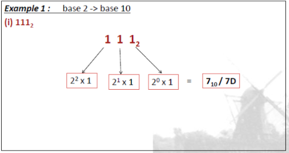
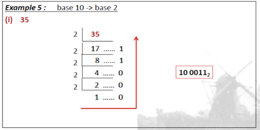
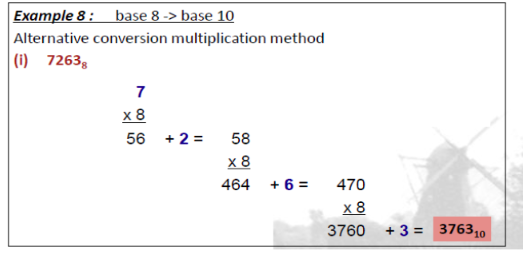
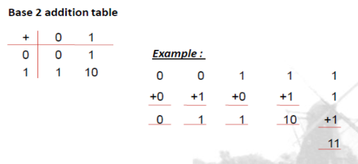
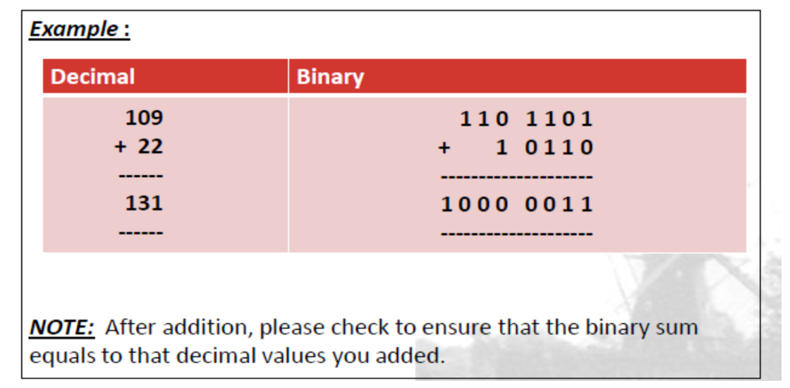
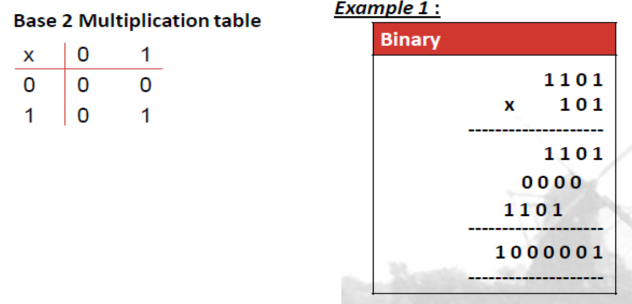
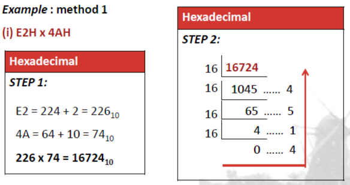
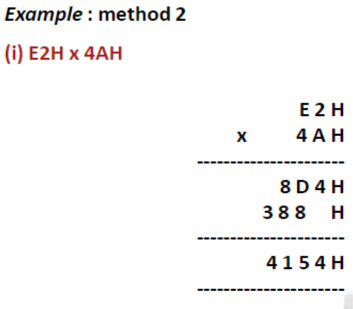

# C1: Numbering Systems

## Introduction

### Binary Numbers

- **Bit**: fundamental building block of computer storage

## Conversion

- Other Base System to Decimal
  - 
- Other Base System to Non-Decimal
  - Convert to decimal, then convert to other bases

### Conversion - shortcuts

### Repeated division

- By dividing the term repeatedly until no longer divisible

- Each iteration, the term is divided by a higher power of divisor (dividing by 8 twice = dividing by 8^2^)

- By figuring out the "leftover" at each iteration, we know what to "leave behind" so that the term can be fully divided by the next iteration without leaving decimals. 

- The "leftover" terms acts as a signal. 

  - It signifies how many "leftover" needs to be added at each place value before moving to the next when deriving the final value. 

  - Alternatively, it signifies how many "parts" of that place value are excluded from the division of the next iteration.

  - Example:

    - 10010~2~ means that the final value is:
      $$
      0*2^5+0*2^4+...+0*2^0
      $$
      but to get the final value, we need to include the leftovers at each iteration, which are:
      $$
      1*2^5
      $$
      and
      $$
      1*2^3
      $$

### Repeated multiplication

- Once you understand the repeated division part, this is basically the reverse.
- Instead of "leaving behind" "signals", we consume those signals to derive the actual value (in decimal).

## 3. Arithmetic

### Addition

- Alternatively, 

### Multiplication

- This is a massive pain and we should leave it to computers. After all, computers are invented to do these things.

### Hexadecimal

- Addition and subtraction are the same
- Multiplication has 2 methods:
  - 
    - Step 1: Convert hex to decimal
    - Step 1.5: Multiply the numbers together in decimal
    - Step 2: Rederive the hexadecimal numbers from decimal numbers 
  - 
    - ERROR: NOT A HUMAN!

## Magic Tricks

- Method 1: Use laying-out-and-addition method
  - Good for binary, not good for others
  - Bad for others
- Method 2
  - Repeated division
  - Good for everything. But not optimal.
- Method 3
  - Use blocks
  - For octal-to-hex: Octal -> Binary -> Hex

- Convert from decimal to binary. Lay out the entire binary 8 bits. Add appropriately.
- Convert from binary to octal. Use 3 bits for every octal digits.
- Convert from binary to hex. Use 4 bits for every octal.

### Exercise

| Binary             | Decimal | Octal | Hex  |
| ------------------ | ------- | ----- | ---- |
| 128+64+16=11010000 | 208     | 320   | D0   |
| 111111001          | 505     | 771   | 1F9  |
| 0100 1110 1110     | 1262    | 2356  | 4EE  |

